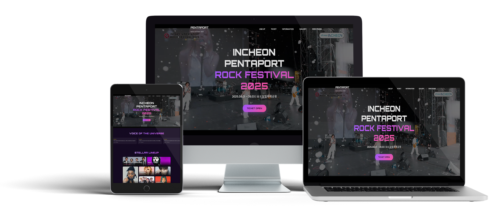

# 👋 About Me
안녕하세요. 웹디자인과 퍼블리싱을 배우고 있는 전진선입니다.
사용자가 쉽게 이해하고 편하게 사용할 수 있는 인터페이스를 만들기 위해
기획부터 디자인, 퍼블리싱까지 전 과정을 직접 경험하며 성장하고 있습니다.
작은 마이크로 인터랙션 하나까지 의미 있게 설계하는 것을 좋아하며,
반응형 웹, 접근성, 퍼포먼스 최적화를 꾸준히 고민합니다.

---

## 💡 Skills

| 분야 | 스킬 |
|-----|------|
| **Design** | Figma, Photoshop, Illustrator |
| **Frontend** | HTML5, CSS3, JavaScript, jQuery |
| **Tools** | VS Code, GitHub, Notion, Slack |
| **AI** | ChatGPT, Claude, Gemini |
| **Etc.** | 반응형 레이아웃, 웹 접근성 고려, 크로스브라우징 테스트 |

---

# 💼 Projects

## 1️⃣ Project 01 : 2025 인천펜타포트록페스티벌
> 대형 음악 페스티벌 공식 프로모션 웹사이트 제작

**📆 제작 기간** : 2025.05.26 ~ 2025.10.20  
**🧑 역할** : 퍼블리싱 100%, 기획 참여  

### ⭐ 프로젝트 설명
페스티벌의 에너지를 살리기 위해 다크 톤과 네온 포인트를 적용하고,  
티켓 예매 → 라인업 → 정보 확인 흐름에 맞춰 레이아웃을 구성했습니다.

- 메인컬러 : 블랙 / 포인트컬러 : 퍼플  

### 🚀 링크
- [무드보드](https://www.figma.com/proto/UJYk4FPG0nr5SFCJ2IBJZG/%EC%9D%B8%EC%B2%9C%ED%8E%9C%ED%83%80%ED%8F%AC%ED%8A%B8%EB%9D%BD%ED%8E%98%EC%8A%A4%ED%8B%B0%EB%B2%8C2025-%ED%94%84%EB%A1%9C%EC%A0%9D%ED%8A%B8?node-id=1-7&t=l3x592lyGHpiySqb-1&scaling=min-zoom&content-scaling=fixed&page-id=0%3A1)
- [인포메이션 아키텍처](https://www.figma.com/proto/UJYk4FPG0nr5SFCJ2IBJZG/%EC%9D%B8%EC%B2%9C%ED%8E%9C%ED%83%80%ED%8F%AC%ED%8A%B8%EB%9D%BD%ED%8E%98%EC%8A%A4%ED%8B%B0%EB%B2%8C2025-%ED%94%84%EB%A1%9C%EC%A0%9D%ED%8A%B8?node-id=18-31&t=FoPz2HPLM04DQ6yD-1&scaling=min-zoom&content-scaling=fixed&page-id=1%3A2)
- [플로우차트](https://www.figma.com/proto/UJYk4FPG0nr5SFCJ2IBJZG/%EC%9D%B8%EC%B2%9C%ED%8E%9C%ED%83%80%ED%8F%AC%ED%8A%B8%EB%9D%BD%ED%8E%98%EC%8A%A4%ED%8B%B0%EB%B2%8C2025-%ED%94%84%EB%A1%9C%EC%A0%9D%ED%8A%B8?node-id=151-464&t=UTcLucvxO7J2cE0b-1&scaling=min-zoom&content-scaling=fixed&page-id=1%3A4)
- [컨셉뷰](https://www.figma.com/proto/7YxhjEPt015kOoBf2rxosN/%EC%BB%A8%EC%85%89%EB%B7%B0?node-id=107-318&t=albQbGwGXot4ResD-1)
- [배포 사이트](https://jinseony25.github.io/portfolio2025/project001)

### 👀 페이지 미리보기
| 메인 페이지|
|-----|
| | 

---

## 2️⃣ Project 02 : 팀버스케이트샵
> 스케이트보드 전문 쇼핑몰 제작

**📆 제작 기간** : 2025.05.26 ~ 2025.10.20   
**🧑 역할** : 퍼블리싱 100%, 기획 100%

### ⭐ 프로젝트 설명
빠른 탐색과 간편 결제에 초점을 맞춘 쇼핑몰입니다.  
카테고리·브랜드·신상품을 직관적으로 구성하고, 결제까지 자연스럽게 이어지도록 했습니다.

- 메인컬러 : 화이트 / 포인트컬러 : 오렌지  

### 🚀 링크
- [무드보드](https://www.figma.com/proto/TSghEgF1Ed5aCHkgVIzAxH/%ED%8C%80%EB%B2%84%EC%83%B5-%ED%94%84%EB%A1%9C%EC%A0%9D%ED%8A%B8?node-id=10-2&t=dBhuqklmzDCVMapE-1&scaling=min-zoom&content-scaling=fixed&page-id=0%3A1)
- [컨셉뷰](https://www.figma.com/proto/TSghEgF1Ed5aCHkgVIzAxH/%ED%8C%80%EB%B2%84%EC%83%B5-%ED%94%84%EB%A1%9C%EC%A0%9D%ED%8A%B8?node-id=679-2&t=He9FICvCOsKyqrNA-1&scaling=min-zoom&content-scaling=fixed&page-id=572%3A2)
- [배포 사이트](https://jinseony25.github.io/portfolio2025/project002)

### 👀 페이지 미리보기
| 메인 페이지 | 
|------------|
| | 

---

## 2️⃣ Project 03 : 벼랑위의 포뇨
> 영화 사이트 제작

**📆 제작 기간** : 2025.05.26 ~ 2025.10.20   
**🧑 역할** : 퍼블리싱 100%, 기획 100%

### ⭐ 프로젝트 설명
바다와 육지를 잇는 순수한 감성과 환상적인 모험을 담은 이야기입니다.
포뇨와 소스케의 동화적이고 따뜻한 교감을 구현하고자 했습니다.

- 메인컬러 : 스카이 블루 / 포인트컬러 : 코랄 레드  

### 🚀 링크
- [무드보드](https://www.figma.com/proto/sAnzYFwM4yxtCVOSkZIrWn/%EB%B2%BC%EB%9E%91%EC%9C%84%EC%9D%98%ED%8F%AC%EB%87%A8?node-id=121-3&t=ylxB9kWPGxPd3ikS-1&scaling=min-zoom&content-scaling=fixed&page-id=119%3A2)
- [컨셉뷰](https://www.figma.com/proto/sAnzYFwM4yxtCVOSkZIrWn/%EB%B2%BC%EB%9E%91%EC%9C%84%EC%9D%98%ED%8F%AC%EB%87%A8?node-id=72-7&t=JAHieb1sZbfvjKGB-1&scaling=min-zoom&content-scaling=fixed&page-id=72%3A5)
- [배포 사이트](https://jinseony25.github.io/portfolio2025/project003)

### 👀 페이지 미리보기
| 메인 페이지 | 
|------------|
| | 

---

## 🎯 배운 점 & 성장 포인트
- 시멘틱 마크업 구조화 정립  
- 일관된 네이밍·디자인 토큰 기반 CSS 재사용성 향상  
- 슬라이드·탭·모달 등 핵심 인터랙션 구현 경험  
- DevTools 기반 디버깅·브라우저/디바이스 점검 루틴 확립  
- Git/GitHub 브랜치 전략·README 정리 버전 관리 및 문서화 경험
